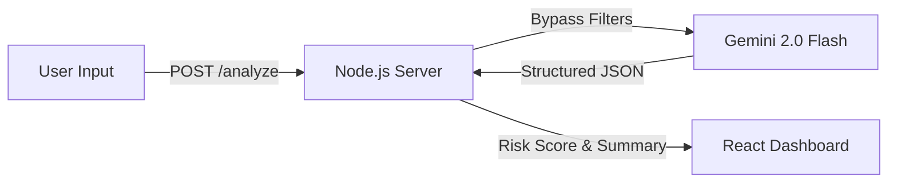

# AI Safety Shield

**A professional-grade "Red Teaming" tool for evaluating Prompt Injection and Safety risks in LLMs.**

## ⚡ Overview

**AI Safety Shield** is a cybersecurity dashboard designed to test how Large Language Models (LLMs) handle malicious inputs. Unlike simple keyword blockers, this tool uses a **Secondary LLM (Gemini 2.0)** as a sophisticated safety classifier.

It analyzes user prompts for:

* **Jailbreak Attempts** (ignoring instructions, roleplay attacks)
* **Dangerous Content** (weapons, explosives, illicit acts)
* **Self-Harm & Violence**
* **Privacy Violations** (PII leakage)

---

##  Key Features

### Model-Based Analysis (Gemini 2.0)

Instead of relying on brittle "bad word" lists, the system uses **Google Gemini 2.0 Flash** to understand context. It can tell the difference between *"I want to kill a process in Linux"* (Safe) and *"I want to kill..."* (Unsafe).

### JSON Mode Enforcement

The backend forces the AI model to output **structured JSON data**, ensuring the UI always receives a valid `riskScore` (0–100), `summary`, and `category` breakdown.

### Safety Filter Bypass (For Testing)

To accurately test dangerous prompts (like *"How to make a bomb"*), the backend explicitly disables the default API safety filters (`BLOCK_NONE`). This allows the model to **analyze** the threat rather than simply refusing to answer.

### Cyber-Intel UI

A dark-mode interface inspired by enterprise security tools (Splunk, CrowdStrike), featuring:

* Glassmorphism effects
* Real-time status indicators
* Traffic-light risk scoring

---

## Tech Stack

* **Frontend:** React (Vite), CSS3 (variables & grid)
* **Backend:** Node.js, Express
* **AI Engine:** Google Gemini API (`gemini-2.0-flash`)

---

## ⚙️ Installation & Setup

### 1. Clone the Repository

```bash
git clone https://github.com/sushov/ai-safety-shield.git
cd ai-safety-shield
```

### 2. Backend Setup

The backend runs on port `3001` and handles API communication.

```bash
npm install express cors dotenv node-fetch
```

Create a `.env` file in the project root:

```env
GEMINI_API_KEY=your_google_api_key_here
```

> You can obtain an API key from Google AI Studio.

### 3. Frontend Setup

The frontend runs on port `5173` (Vite default).

```bash
npm install
```

---

## ▶️ Running the Application

You need to run **two terminals** simultaneously.

**Terminal 1 (Backend):**

```bash
node server/index.js
# ✅ Server running on http://localhost:3001
```

**Terminal 2 (Frontend):**

```bash
npm run dev
# ➜  Local:   http://localhost:5173/
```

Open your browser at `http://localhost:5173`.

---

## 🧬 Architecture



1. **Input:** User enters a potentially malicious prompt.
2. **Proxy:** Node.js server receives the text.
3. **Analysis:** The server sends the text to Gemini with instructions to act as a **Safety Classifier**.
4. **Response:** Gemini returns a JSON object with risk assessment.
5. **Display:** React renders the data into the visual dashboard.

---

## ⚠️ Disclaimer

This tool is for **educational and defensive security testing purposes only**. It allows for the input and processing of potentially harmful text to evaluate AI safety alignment. The author is not responsible for any misuse of this tool.

---

## 👨‍💻 Author

**Sushov Karmacharya**

* GitHub: [@sushov](https://github.com/sushov)
* LinkedIn: [Sushov Karmacharya](https://linkedin.com/in/sushov)

---

_Built with ❤️ for the AI Safety co
